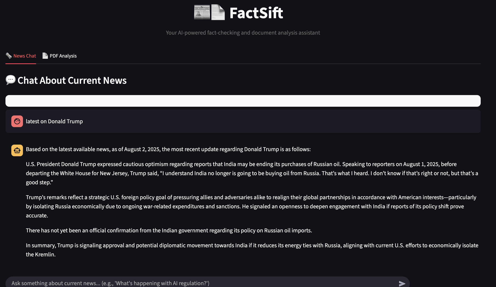

## 📡 FactSift

FactSift uses a Google Search wrapper to fetch relevant news URLs in real time. Each article undergoes the following process:

1. **Content Extraction**: Web pages are loaded and parsed into clean text.
2. **Quality Scoring**: Each document is evaluated for:
   - **Source credibility** (e.g., `reuters`, `bbc`, `cnn`, `hindustantimes` etc.)
   - **Recency** (based on how many days old it is)
   - **Content length** (ideal size range)
3. **Semantic Ranking**: LangChain's vector store performs similarity search against the user query.
4. **Score Fusion**: For each document, a **final score** is computed using the formula:




### Final Document Score

final_score = α * similarity_score + β * credibility_score

α = 0.8, β = 0.2

```python
final_score = 0.8 * similarity_score + 0.2 * quality_score
```

## 🛠 Tech Stack

- [OpenAI GPT API](https://platform.openai.com/)
- [LangChain](https://www.langchain.com/)
- [Streamlit](https://streamlit.io/)
- [Tesseract OCR](https://github.com/tesseract-ocr/tesseract) (for PDF text extraction)
- `newspaper3k`, `requests`, `BeautifulSoup4` (for web scraping)

---

## 📦 Installation

```bash
# Clone the repository
git clone https://github.com/yourusername/newsbot.git
cd newsbot

# Create a virtual environment
python -m venv venv
source venv/bin/activate  # or venv\Scripts\activate on Windows

# Install dependencies
pip install -r requirements.txt
